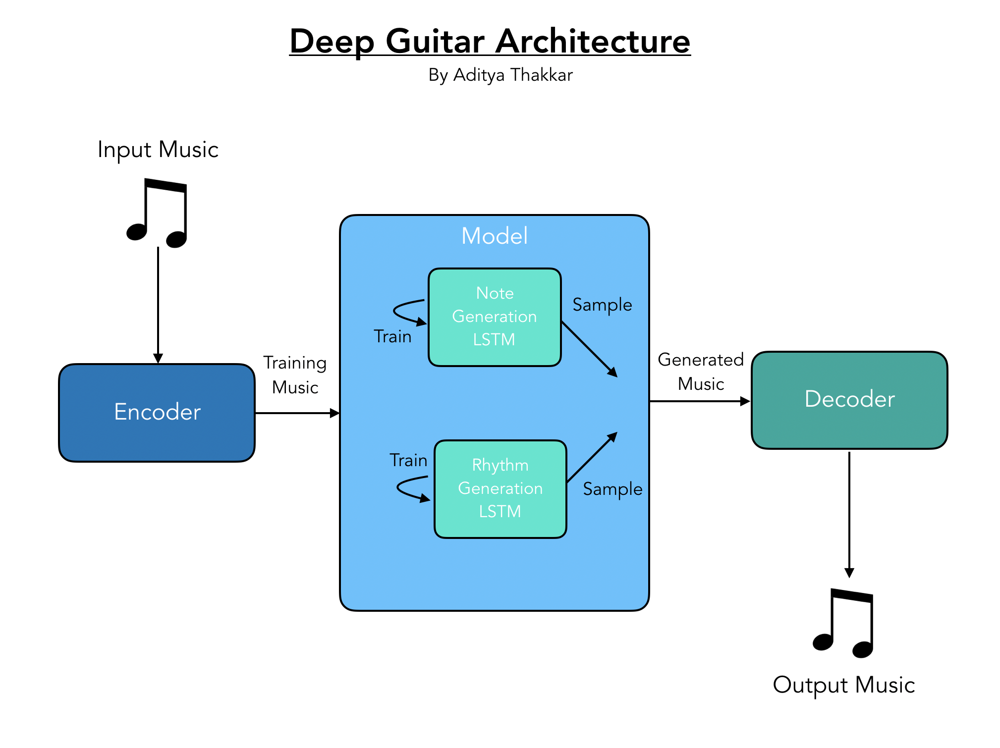

# Deep Guitar 

Guitar Music Written with Deep Learning

## Listen!
Check it out on SoundCloud: [Listen!](https://soundcloud.com/adityathakkar/deep-guitar)

## Technical Details

- Uses two LSTM networks with Keras to generate both the notes and the rhythm for the piece
- Uses Music21 to process and encode MIDI files

